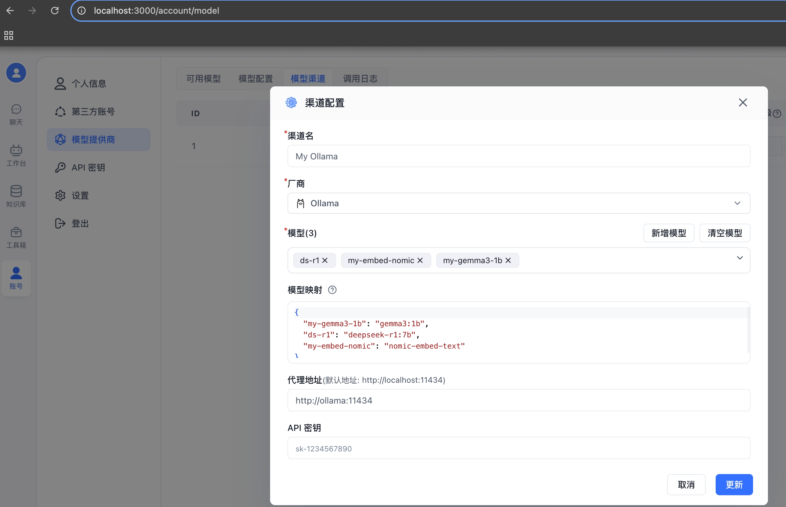
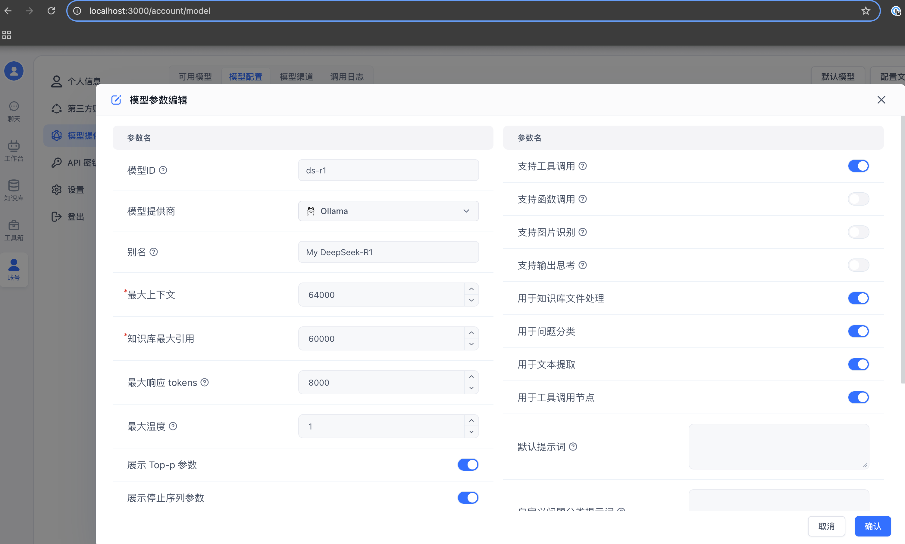
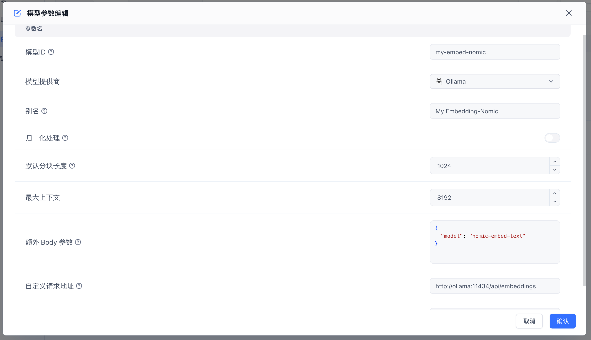

# FastGPT + Ollama + DeepSeek-R1 本地环境最佳实践

基于开源平台 [FastGPT](https://github.com/labring/FastGPT/tree/main) 和开源大模型 [DeepSeek R1](https://ollama.com/library/deepseek-r1) 在本地环境搭建和知识库和问答平台的最佳实践。提供开箱即用的数据处理、模型调用等能力。同时可以通过 Flow 可视化进行工作流编排，从而实现复杂的问答场景！
</div>

## 本地设备配置及模型版本
- #### 本地设备配置
    -  操作系统版本：MacOS Sequoia 15.2
    - 处理器：处理器 2.9GHz 六核 Intel Core i9
    - 图形卡： Intel UHD Graphics 630 1536 MB
    - 内存：32 GB 2400 MHz DDR4
    - 磁盘：500G
    - Docker Desktop: 4.38.0 （如果安装了桌面版，docker 和 docker compose 不用再单独安装）
    - Docker: 27.5.1
    - Docker Compose: v2.32.4-desktop.1
- #### 框架及模型版本
    - FastGPT: [v4.9.3](https://github.com/labring/FastGPT/pkgs/container/fastgpt/383840341?tag=v4.9.3)
        >  模型管理、数据预处理及RAG配置、知识库管理及工作流编排的可视化开源平台
    - AIProxy: [v0.1.5](https://github.com/labring/aiproxy/pkgs/container/aiproxy/383652347?tag=v0.1.5)
        > 基于OpenAI 标准规范的 AI 网关，可以快速调用常用模型
    - Ollama: [latest](https://hub.docker.com/r/ollama/ollama/tags)
        > 适合本地环境的大语言模型管理工具，可快捷进行下载、配置、启动、删除等常用操作
    - DeepSeekR1: [deepseek-r1:7b](https://ollama.com/library/deepseek-r1)
        > 目前最火爆的开源的深度思考大语言模型之一，7b 最少需要8G以上的内存，如果设备配置较低，可以修改 compose 文件 ollama 服务下的环境变量 `TO_PULL_MODELS` 和 `TO_RUN_MODELS` 来选择1.5b的版本
    - Gemma3: [gemma3:1b](https://ollama.com/library/gemma3)
        > Google 开源的可用进行文本处理及图片理解的轻量级大模型，因为FastGPT 开源版本不支持创建图片索引和补充索引，所以Demo只是支持这类模型的配置，实际创建知识库时可以配置该模型但没法创建索引。**如果不需要或者设备配置有限可以直接从compose 配置中删除该模型**，可以修改 compose 文件 ollama 服务下的环境变量 `TO_PULL_MODELS` 和 `TO_RUN_MODELS`。
    - Embedding: [nomic-embed-text](https://ollama.com/library/nomic-embed-text)
        > 自定义配置的内嵌模型

## 快速启动各服务及配置
- 一键启动框架平台及模型服务 （**如果在中国大陆访问请提前配置好VPN**）
- 下载配置文件：`下载的目录不要放在Mac的 Desktop 目录下，因为一般 Desktop 会有特殊的权限限制，Docker 文件挂载可能会受限`。
    - 下载 `docker-compose.yml`
        ```shell
            curl -O https://raw.githubusercontent.com/shadowwalkerzh/fastgpt-ollama-deepseek-r1/refs/heads/main/docker-compose.yml > docker-compose.yml
        ```
    - 下载 `config.json`
        ```shell
            curl -O https://raw.githubusercontent.com/shadowwalkerzh/fastgpt-ollama-deepseek-r1/refs/heads/main/config.json > config.json
        ```
    - 运行
        ```
            docker compose -f docker-compose.yml up -d
        ```
- 首次启动时，因为要下载大模型和各镜像文件，需要花费比较长的时间，如果是下载 DeepseekR1:7b 需要5-10分钟
    > 执行完成后可以通过 `docker logs -f --tail=100 ollama` 观察启动日志，看模型文件是否已经下载完成，并且完成启动成功。如果出现 `启动模型服务: xxx` 之类的日志并且没有报错说明模型下载并启动完成了。可以执行 `docker exec -it ollama sh` -> `ollama list`  看下载了哪些模型，`ollama ps` 看已经运行成功了哪些模型。
- 所有服务启动后，就有一些地址可以访问：
    - FastGPT 平台：http://localhost:3000
    - AI Proxy Swagger：http://localhost:3001/swagger/index.html
- 接下来开始配置自定义模型：
    - 登录 FastGPT 平台，默认账号 `root` 密码为：`1234`
    - 账号 -> 模型提供商 -> 模型渠道 -> 添加渠道 -> Ollama 渠道，并添加配置，如图：
        > 

    - 账号 -> 模型提供商 -> 模型配置 -> 添加模型，分别添加两个语言模型 `ds-r1`, `my-gemma3-1b` 和索引模型 `my-embed-nomic`， 索引模型需要单独配置调用API。如图： 
        >   
    - 将新增的3个模型在 `Ollama 渠道` 编辑中添加进来后，就跟第一张图的结果一样了
    - 模型测试：可以在 `模型渠道` 里选择 `Ollama` 并批量测试模型，返回成功表示模型连通， 也可以在模型配置界面选择对应的模型进行测试。
    - 创建自己的知识库：知识库 -> 新建，先创建自己的一个语料集合，然后再添加自己的知识库文件，选择合适的分段策略，然后在确认，在右侧就可以看到和选择对应的 `索引模型`,`文本理解模型`,`图片理解模型`，状态为 `已就绪`表明重新创建索引完成。可以通过 `搜索测试` 菜单进行测试。这里可以补充你已经有离线语料，并进行合理的配置后重新创建索引。
    - 创建自己的ChatAPP 应用：工作台 -> 创建 -> 简易应用 -> `First APP`: 可以选择对应的语言模型，配置相关的知识库及其它参数，在右侧可以发送消息测试。成功后点击右上角保存。
    - 测试聊天服务：聊天 -> 选择对应的应用，可以进行聊天了，窗口顶部可以展示对应的使用模型信息。

## 相关引用
- [FastGPT](https://github.com/labring/FastGPT)
- [AI Proxy](https://github.com/labring/aiproxy)
- [Ollama](https://github.com/ollama/ollama)
- [DeepSeek](https://github.com/deepseek-ai/DeepSeek-R1)
- [Gemma3](https://ollama.com/library/gemma3)
